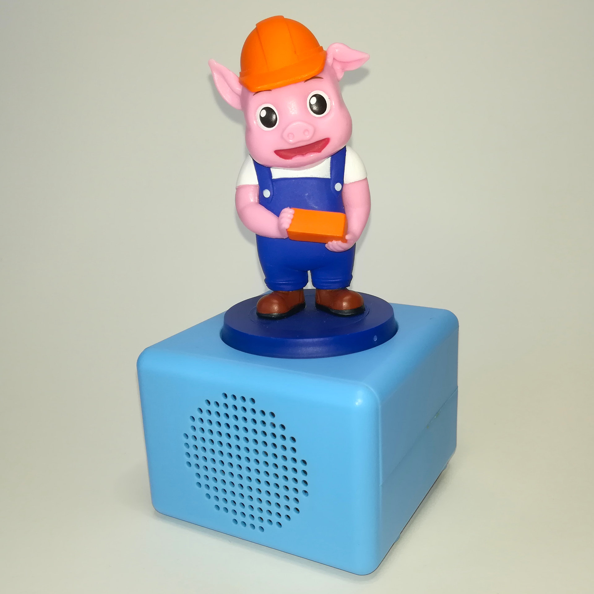
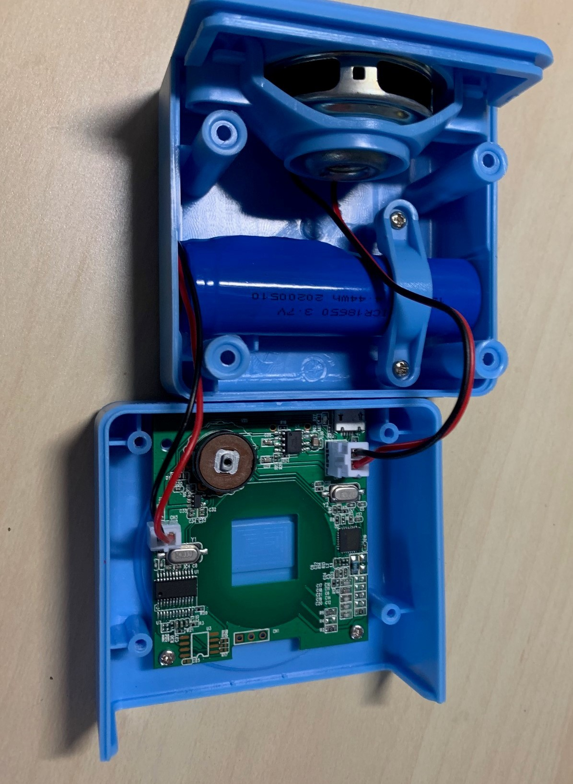

# Hachette (Blue version)


The device called "*hachette*" here is sold in multiple european countries under different names, by a company named [hachette](https://www.hachettebookgroup.com/) *(Click on the name for more information about a particular variant)*:

- In Germany, it is called "*[Märchenheld](DE/)*" ([Homepage](https://maerchenheld-sammlung.de/))
- In Greece, it is called "*[Hxografhmena Paramythia](GR/)*" ([Homepage](https://www.audiotales.gr/))
- In Poland, it is called "*[Opowiadajki](PL/)*" ([Homepage](https://opowiadajki.pl/))
- It is apparently also sold in Spain and probably some other european countries as well, but I currently do not have any information on those versions *(If you know about one of these versions, please tell me)*

It is being sold as a collection, with each issue being a bundle of a figure and the affiliated book.

The hardware, encryption, NFC tags etc. seems to be identical in all countries (?).

## Program usage

### Show general command overview

```sh
$ audiocube.py hachette --help
usage: audiocube.py hachette [-h] {encrypt,decrypt,create_nfc_file} ...

Toolbox for "Hachette"

positional arguments:
  {encrypt,decrypt,create_nfc_file}
                        The command to execute

optional arguments:
  -h, --help            show this help message and exit
```

### Encrypt/Convert .mp3 files to .smp

To encrypt/convert .mp3 file(s) to the .smp format, use the `encrypt` command:

```sh
$ audiocube.py hachette encrypt --help
usage: audiocube.py hachette encrypt [-h] [--output_file_pattern OUTPUT_FILE_PATTERN] input_file [input_file ...]

Encrypt audio file(s)

positional arguments:
  input_file            The input file(s) to read from

optional arguments:
  -h, --help            show this help message and exit
  --output_file_pattern OUTPUT_FILE_PATTERN, -ofp OUTPUT_FILE_PATTERN
                        Pattern for the output filenames (default: {name}.smp)
```

For example, to encrypt/convert files T0010.mp3 and T0011.mp3 to T0010.smp and T0011.smp:

```sh
$ audiocube.py hachette encrypt T0010.mp3 T0011.mp3
"T0010.mp3" -> "T0010.smp"
"T0011.mp3" -> "T0011.smp"
```

### Decrypt/Convert .smp files to .mp3

To decrypt/convert .smp file(s) to the .smp format, use the `decrypt` command:

```sh
$ audiocube.py hachette decrypt --help
usage: audiocube.py hachette decrypt [-h] [--output_file_pattern OUTPUT_FILE_PATTERN] input_file [input_file ...]

Decrypt audio file(s)

positional arguments:
  input_file            The input file(s) to read from

optional arguments:
  -h, --help            show this help message and exit
  --output_file_pattern OUTPUT_FILE_PATTERN, -ofp OUTPUT_FILE_PATTERN
                        Pattern for the output filenames (default: {name}.mp3)
```

For example, to decrypt/convert files T0010.smp and T0011.smp to T0010.mp3 and T0011.mp3:

```sh
$ audiocube.py hachette decrypt T0010.smp T0011.smp
"T0010.smp" -> "T0010.mp3"
"T0011.smp" -> "T0011.mp3"
```

### Create a compatible NFC tag

#### Step 1: Create a .mct file

The [docs/devices/hachette/nfc](https://github.com/oyooyo/audiocube/tree/master/docs/devices/hachette/nfc) directory contains ready-to-use `.mct` files that should be sufficient if you just want to create a backup NFC tag for an existing figure, in which case you can skip this step. If however you want to create your own fairytales, you should follow this section to create your own custom NFC tag for this fairytale.

To create a compatible NFC tag, start by using the `create_nfc_file` command:

```sh
$ audiocube.py hachette create_nfc_file --help
usage: audiocube.py hachette create_nfc_file [-h] directory_id file_id [name]

Create a NFC tag content file, in order to create a compatible ("Mifare Classic") NFC tag via the "MIFARE Classic Tool" (https://play.google.com/store/apps/details?id=de.syss.MifareClassicTool) smartphone app

positional arguments:
  directory_id  The directory ID, a hexadecimal string in range 00...FF
  file_id       The file ID, a hexadecimal string in range 0000...FFFF
  name          The name/label for this NFC tag. Determines the output file name. Optional, defaults to "TMB{directory_id}_T{file_id}" (default: None)

optional arguments:
  -h, --help    show this help message and exit
```

For example, to create a NFC tag that will play audio file `T0023.smp` in directory `TMB01`:

```sh
$ audiocube.py hachette create_nfc_file 01 0023
```

The above command will create a file called `TMB01_T0023.mct`.

#### Step 2: Write the .mct file to a *Mifare Classic* NFC tag

In order to actually create the NFC tag from the `.mct` file created in step 1, you need to perform the following steps afterwards:

1. Install the free and open source "[MIFARE Classic Tool](https://play.google.com/store/apps/details?id=de.syss.MifareClassicTool)" smartphone app, if you haven't done so yet
2. Copy the `.mct` file created in step 1 to directory `/sdcard/MifareClassicTool/dump-files/` on your Android smartphone
3. Open the "[MIFARE Classic Tool](https://play.google.com/store/apps/details?id=de.syss.MifareClassicTool)" app
4. Click "*Write Tag*"
5. Click "*Write Dump (Clone)*", then "*Select Dump*"
7. Choose the `.mct` file that you created in step 1, then click "*Select Dump*"
8. Hold the "*Mifare Classic*" NFC tag that you want to write to the location of the NFC reader on the back of your smartphone. You should here a tone and a "*New Tag found (UID:xxxxxxxx)*" message should be displayed
9. Keep the NFC tag in this position, click "*OK*", then "*Start mapping and write dump*"

## Files

### Filesystem

ToDo

### MP3 File format

The device doesn't seem to be very picky about the MP3 files. The files on the german version are encoded at 48kHz Stereo @ 320kbit.

### Encryption

The MP3 files the device plays are encrypted with a simple algorithm:
1. The whole file is then XORed with the byte array \[0x51, 0x23, 0x98, 0x56]\]

## NFC Tags

The device uses `Mifare Classic 1k` NFC tags.

## Photos




## Credits

"**Marc D.**" figured out and [published](https://www.mikrocontroller.net/topic/503014) all relevant information about the device
